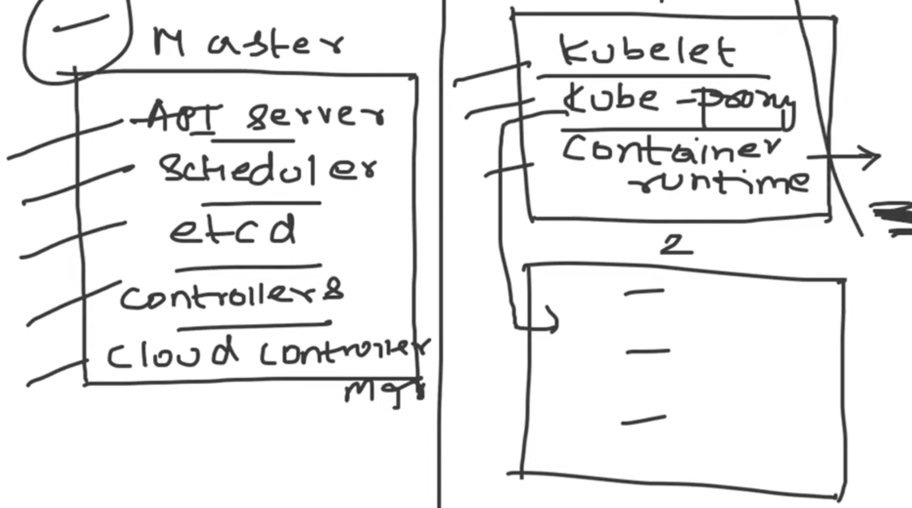

##### KUBERNETES ####

1. Docker Vs Kubernetes ==> Docker is a container platform that makes us interacting with and using the containers effectively.
        Kubernetes is an container orchestration platform.

2. There are multiple problems we face while handling the container:-   
    a) Containers are "Ephemeral" in nature => means something that is shortlived in nature, something that die and revive anytime.
    Ex:- consider having 100 containers where the first container is using a lot of memory and power from the host system, and is impacting the 50th or 99th container and it will die as it's not getting enough resources due to the "Single Host" problem as it relies on only one host.

    b) Consider someone kills a container, immediately the application inside the container will not be accesible, unless someone starts the container it won't work unless someone acts upon it manually, and this problem is called "Auto Healing". Now if there are thousands of containers it's not possible for us to manually check each and every container.

    c) When there is a sudden increase in load on the application deployed on the container, the container doesn't have the "Auto scaling" feature which would allow it to scale up to match up the increased load. We cannot manually increase the container count as well because it doesn't have the load balancing feature enabled.

    d) Docker is a very minimalistic or very simple platform, by default it doesn't support any of our enterprise level applications support [Means the applications which needs these basic supports to run, also called "Enterprise Level Standards" ex:- Load Balancer, Firewall, Auto Scaling, Auto healing, API Gateways ]. But docker doesn't have the enterprise level standards by default.

3. So KUBERNETES solves all the above 4 problems faced by Docker.
    a) By default Kubernetes is installed as a "Cluster"[Meaning Group of Nodes], or in general it is installed in a "Master-Node Architechture". So the benefit here is incase there is a "Single host" issue of any container, Kubernetes will put the effected container in a different node immediately so that it is not impacted. 

    b) Kubernetes controls and fixes the damage faced in the "Auto Healing" issue, it has an "Auto healing" feature by which whenever the container goes down, or even before it goes down, kubernetes starts a new container using API server which recieves a signal before a container goes down and immediately a new container is rolled out by Kubernetes, so the end user won't be aware of container going down.

    c) Kubernetes has something called as "Replication Controller" OR "Replica Sets", so there is a YAML file for the Replica Sets where we can increase the number of containers to adjust the increase in load, also for automated approach Kubernetes supports "HPA -> Horizontal Pod Autoscaler" using which we can adjust the load automatically by spinning containers. This helps in solving the "Auto Healing" issue.

    d) People at google formed an enterprise level container orchestration platform[called Borg, which is not open source and they consider that Kubernetes is a part of borg] because docker doesn't have such capabilities. To run an application on a platorm which is not enterprise ready is not at all recommended, so that is why docker is NEVER used in production.

4. Kubernetes Architechture => 
    a) Kubernetes has a "master and worker" architechture[OR multiple master and worker], where the request goes to worker via master. Note:- In Kubernetes the smallest level of deployment is called "Pod" whereas in Docker it's called a container. Pod is just like a wrapper over our container which has some advanced capabilities. Master node ==> "Control Plane" and Worker node ==> "Data Plane"
        ------Below components are present on the worker node/data plane of kubernetes------
    b) Kubelet => Responsible for creating, running and maintaining the kubernetes pod, it looks if the pod is always running or not, if not running then kubernetes has an auto-healing feature by which the kubelet informs control plane to do something about it.

    c) Container runtime => Rumtime environment inside the pod to run the container. In docker we have a docker runtime called as "Dockershim", but in kubernetes we can use any container runtime like dockershim, containerd, crio. Docker can only support dockershim as a runtime but kubernetes can support any of the above mentioned runtime.

    d) Kube-proxy => Provides networking related configuration in kubernetes pod[Like Docker0 or bridge networking in docker.], like providing IP Address, load balancing capability, which helps in auto-scaling and distributing load between the pods. It uses IP tables on our Linux machine.
        ------Below components are presnt on the master node/control plane of kubernetes------
    e) API Server => Acts as a core component of Kubernetes and takes all the incoming request and decides on which node should the pod be created. This component exposes the kubernetes to the external world.

    f) Scheduler => Responsible for scheduling the resources or pods on kubernetes, but the decision on where or which node to schedule the resources is done by API server and the scheduler acts on it.

    g) ETCD => Acts as a backup service, basically a key-value store and the entire kubernetes cluster information is stored here as a backup in the form of key-value pair.

    h) Controller Manager => Controllers which manage the auto-scaling feature of kubernetes, they manage the controllers[there can be multiple controllers] to make sure they are always running. Some controllers are:-
            i) Replica Set => Maintains the state of the kubernetes pods. 

    i) Cloud Controller Manager[CCM] => Kubernetes can be deployed on cloud services like AWS, Azure etc, now if there is a request from the user to create a service like load balancer or storage, so CCM helps the kubernetes to undertand the underlying cloud provider, and helps to understand the request from user and translate the request from the user to the API request that the cloud provider understands.
    This mechanism has to be implemented under CCM. This is an open source entity where we can edit the code as per our cloud provider.
        *This component is NOT AT ALL required if we are running the kubernetes on our on-premise servers*.
        